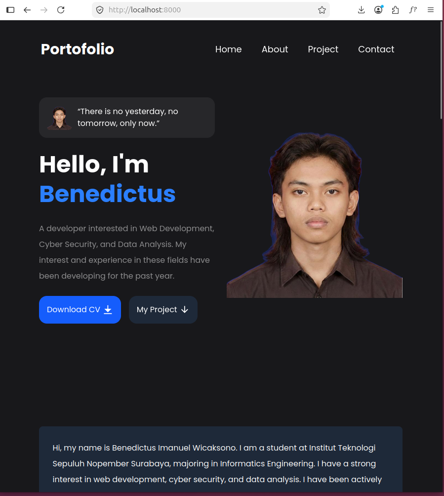
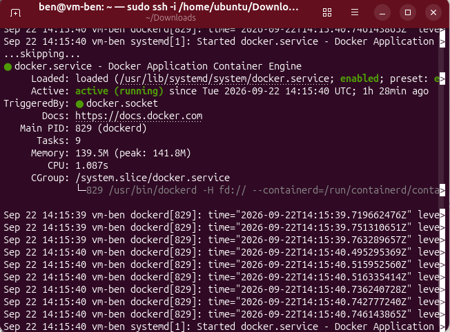
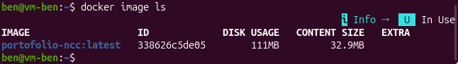

# Dokumentasi

Berikut adalah dokumentasi untuk menjalankan website ini secara local dengan menggunakan docker dan azure.

## Persiapan Dockerfile

> Pertama-tama persiapkan `Dockerfile` yang akan membungkus proyek website di direktori utama `portofolio-ncc`, isinya sebagai berikut.
```
FROM node:20-alpine AS builder

WORKDIR /app

COPY package*.json ./

RUN npm install

COPY . .

RUN npm run build

FROM nginx:alpine

RUN rm -f /etc/nginx/conf.d/default.conf

COPY nginx.conf /etc/nginx/nginx.conf

COPY --from=builder /app/dist /usr/share/nginx/html

COPY entrypoint.sh /entrypoint.sh
RUN chmod +x /entrypoint.sh

EXPOSE 8080

CMD ["/entrypoint.sh"]
```

> Buat `entrypoint.sh` di direktori yang sama
```
#!/bin/sh
set -e

# VM_HOSTNAME is expected to be passed in at "docker run" time, e.g.:
#   docker run -d -e VM_HOSTNAME=$(whoami) -p 8080:8080 breakout-lb-demo
#
# We sanitize it down to only what a Linux whoami can legally contain
# (letters, digits, hyphen) before writing it into a JS file. This avoids
# any chance of breaking the generated script or injecting something
# unexpected into the page.
SAFE_HOSTNAME=$(printf '%s' "${VM_HOSTNAME:-unknown}" | tr -cd 'A-Za-z0-9-')

if [ -z "$SAFE_HOSTNAME" ]; then
  SAFE_HOSTNAME="unknown"
fi

cat > /usr/share/nginx/html/config.js <<EOF
window.APP_CONFIG = { hostname: "${SAFE_HOSTNAME}" };
EOF

echo "Starting Portofolio, whoami injected as: ${SAFE_HOSTNAME}"

exec nginx -g "daemon off;"
```

>Buat juga `nginx.conf` seperti pada modul
```
worker_processes auto;

events {
    worker_connections 1024;
}

http {
    include       /etc/nginx/mime.types;
    default_type  application/octet-stream;
    sendfile      on;

    server {
        listen 8080;
        server_name _;

        root /usr/share/nginx/html;
        index index.html;

        location / {
            try_files $uri $uri/ =404;
        }
    }
}
```

>   Setelah itu, proyek siap di-build di perangkat local masing-masing dengan command berikut
```
sudo docker run --name web-portofolio -p 8000:8080 -d portofolio-ncc
```

> Cek apakah docker sudah berhasil


> Bungkus image docker dengan format `.tar`
```
docker save portofolio-ncc -o portofolio-ncc.tar
```


## Persiapan Virtual Machine

> Buat vm terlebih dahulu pada resource group yang sama di Azure seperti yang diajarkan pada modul.

> Untuk team10, login ke vm masing masing harus didahului dengan terhubung ke vm-radhit dengan command `sudo ssh -i ~/Downloads/lbe_team10 radhit@70.153.148.165`.

> Setelah itu, baru bisa masuk ke vm saya sendiri yaitu dengan memasukkan `ssh ben@10.0.0.7` beserta password saya.

> Memastikan docker terinstal dan berjalan.
```
docker --version
sudo systemctl status docker
```


> Pindahkan image berformat `.tar` ke `vm-radhit` terlebih dahulu
```
scp -i lbe_team10 portofolio-ncc.tar radhit@70.153.148.165
```

> Pindahkan lagi ke vm masing-masing di dalam resource group dengan username dan ip address masing-masing vm.
```
scp portofolio-ncc.tar  ben@10.0.0.7:~/
```
**eksekusi command ini di vm-radhit**

> Kembali ke vm masing-masing, lalu coba load docker image tadi.
```
docker load -i portofolio-ncc.tar
```

> Cek `docker image ls` untuk mengetahui apakah proses load berhasil.


> Jalankan websitenya dengan command berikut
```
docker run -d --name portofolio-ncc -p 8000:8080 -e VM_HOSTNAME=$(whoami) portofolio-ncc:latest
```

> Tes hasilnya dengan localhost sesuai port yang digunakan
```
curl -s http://localhost:8080/
```

